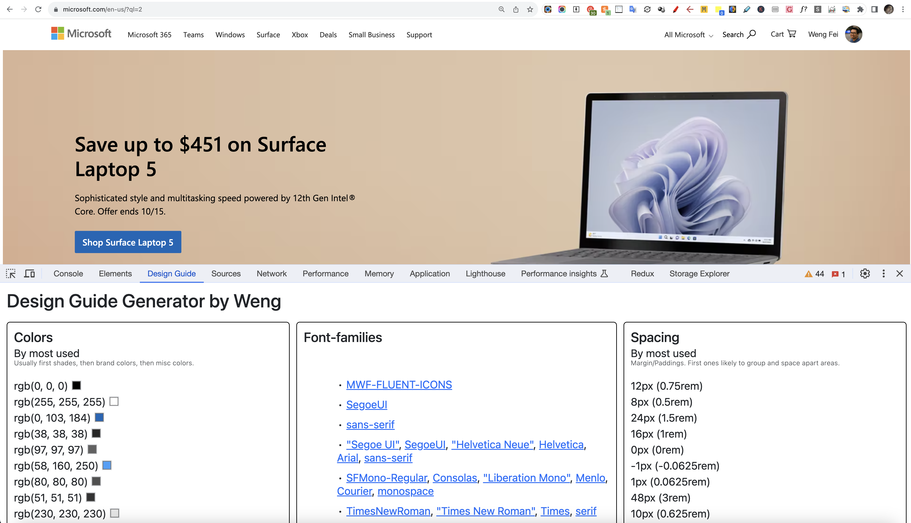
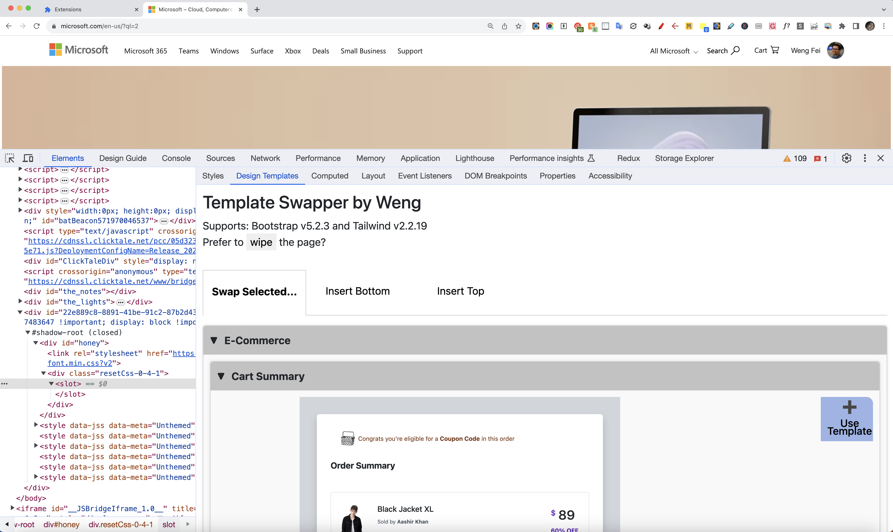
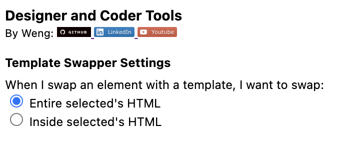

# Designer and Coder Tools (Chrome Extension)


<a target="_blank" href="https://github.com/Siphon880gh/stocks-technical-analysis" rel="nofollow"></a>
<a target="_blank" href="https://www.linkedin.com/in/weng-fung/" rel="nofollow"></a>
<a target="_blank" href="https://www.youtube.com/user/Siphon880yt/" rel="nofollow"></a>

:page_facing_up: Description:
---
By Weng Fei Fung. 

Various tools to make the web designer and coder's job easier.

Quickly identify the colors, fonts, and spacing amounts of websites. 

Design an entirely new website or experiment with modifying the current website's layout inside Chrome with our huge selections of slides and components. You can swap website parts or add to the website from inside DevTools so you don't have to leave the current tab. Because the template code is conveniently in Tailwind 2 and Bootcamp 5, you can copy the produced HTML to another Tailwind/Bootcamp project.

Font Awesome 3-6 icons supported in the templates. For rearranging blocks, for now you have to drag and drop elements in the Elements panel. More development if interest in this extension is shown.

## :open_file_folder: Table of Contents:
---
- [Description](#page_facing_up-description)
- [Screenshots](#camera-screenshots)
- [Attribution](#handshake-attribution)
- [Developer Notes](#computer-developer-notes)
- [Future Version](#crystal_ball-future-version)
---

## :camera: Screenshots:

#### Design Guide Generator


#### Template Swapper or Site Builder

#### Settings


## :handshake: Attribution
Thanks to Freepik at Flaticon for the [icon](https://www.flaticon.com/free-icon/ux_1055666?term=design&page=1&position=6&origin=search&related_id=1055666).


## :computer: Developer Notes

To add more templates, add them to templates.html, unless they are textarea code that can easily be modified before inserting, then thoes go inside sidebar.html

The pattern is such (because code inside a script tag of type x-template will not be executed): 
```
<li>Name
    <script type="text/x-template" data-scale=".25">
    Your template whether bootstrap or tailwind
    </script>
</li>
```

If you have nested, you may do
```
<ul>
    <li>Name
        <script...>
    </li>
    <li>Name
        <script...>
    </li>
</ul>
```

If the template is too large for the sidebar, you can resize it down at the script tag.
`<script type="text/x-template" data-scale=".25">`

Which could cause it to be too far from the left or the top. You can additionally adjust like:
`<script type="text/x-template" data-scale=".25" data-margin-left="-50%" data-margin-top="-10px">`

You can inspect the sidebar to see what most templates are scaled at.

Your template script block can contain style blocks inside, but keep in mind that the style block does not override your other templates' styles which can affect their appearance in the sidebar or on the content page.

## :crystal_ball: Future version
- Future version will have paid tier with premium templates, personally modified template variations, and AI-filler with brand colors/fonts and content, if enough interest in this feature is shown.
- The paid version will connect to an API like https://###...com/main/engine/chrome-templates/ and checks your license code
- Detect if wordpress, squarespace, wix, etc.